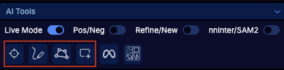
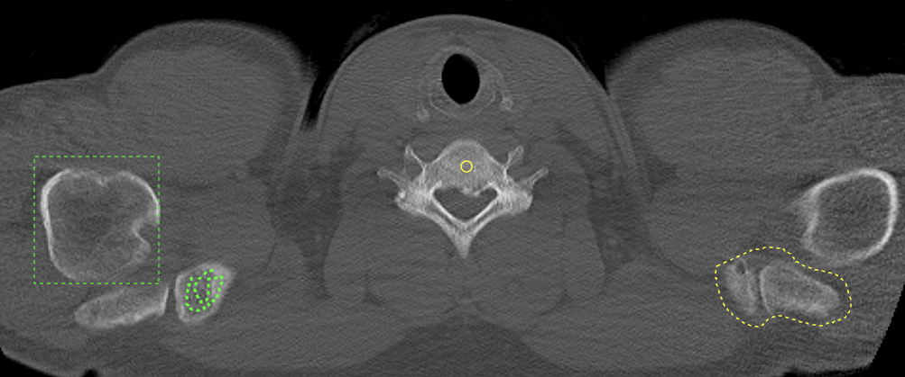
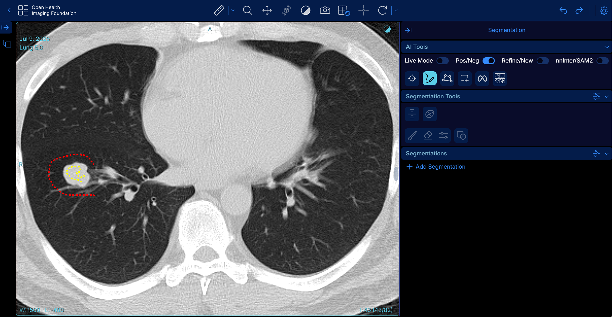
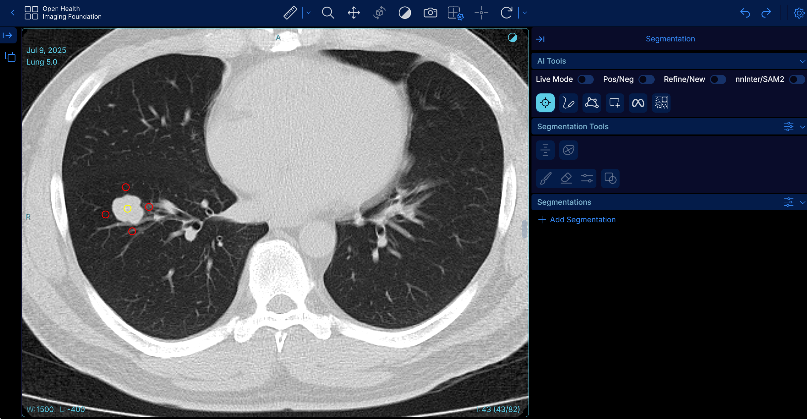

# OHIF-AI

## How to use?

### Segmentation Prompts

The tool provides 4 different prompt types for segmentation (shown in red boxes from left to right):



- **Point**: Click to indicate what you want to segment
- **Scribble**: Paint over the structure to include
- **Lasso**: Draw around and surround the structure inside the lasso
- **Bounding Box**: Draw a rectangular box to surround the target structure



### Running Inference

After providing prompts, you can run inference by clicking one of the manual inference buttons located next to the red box:
- **SAM2 inference**: Click to run SAM2
- **nnInteractive inference**: Click to run nnInteractive

**Live Mode**: To avoid manually clicking the inference button every time, you can enable **Live Mode**. Once enabled, the model will automatically segment the target structure on every prompt you provide.

### Positive and Negative Prompts

You can exclude certain structures from your segmentation by toggling on the **neg.** (negative) button before providing prompts.

**Negative Scribble Example:**


**Negative Point Example:**


### Refine vs. New Segment

Toggle between **Refine/New** button to:
- **Refine**: Keep refining the current segment with additional prompts
- **New**: Create a new separate segment

You can revisit and edit existing segments by clicking on the target segment in the segmentation list.

### Model Selection

You can select which model to use:
- **nnInteractive**: Supports all prompt types (point, scribble, lasso, bounding box)
- **SAM2**: Currently supports positive/negative points and positive bounding box only

## Demo Video

[](https://youtu.be/z3aq3yd-KRA)


## Highlights


## Updates


## Prerequisite

- Install Docker, NVIDIA Container Toolkit

- tested version: Docker: 27.3.1, NVIDIA Container Toolkit: 1.16.2, CUDA Version: 12.6

## Getting Started

- Run `bash start.sh`
- Go to http://localhost:1026
- Upload all DICOM files in sample-data


## Next steps


## (potential) FAQ

- Q: Load library (libnvidia-ml.so) failed from NVIDIA Container Toolkit
- A: Run `sudo apt-get install --reinstall docker-ce ` [Reference](https://github.com/NVIDIA/nvidia-container-toolkit/issues/305)

- Q: `Failed to initialize NVML: Unknown Error` Or `No CUDA available``
- A: Edit `no-cgroups = false`in `/etc/nvidia-container-runtime/config.toml` [Reference](https://forums.developer.nvidia.com/t/nvida-container-toolkit-failed-to-initialize-nvml-unknown-error/286219/2)

## How to Cite

[Paper, ISBI 2025](https://ieeexplore.ieee.org/document/10981119)

```bibtex
@INPROCEEDINGS{10981119,
  author={Cho, Jaeyoung and Rastogi, Aditya and Liu, Jingyu and Schlamp, Kai and Vollmuth, Philipp},
  booktitle={2025 IEEE 22nd International Symposium on Biomedical Imaging (ISBI)}, 
  title={OHIF -SAM2: Accelerating Radiology Workflows with Meta Segment Anything Model 2}, 
  year={2025},
  volume={},
  number={},
  pages={1-5},
  keywords={Image segmentation;Limiting;Grounding;Foundation models;Biological system modeling;Radiology;Biomedical imaging;Web-Based Medical Imaging;Foundation Model;Segmentation;Artificial Intelligence},
  doi={10.1109/ISBI60581.2025.10981119}}
```
