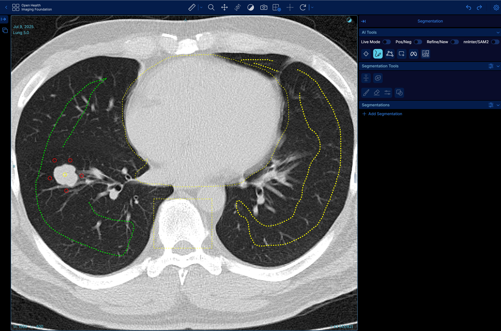

# OHIF-AI

**OHIF-AI** integrates advanced interactive segmentation models such as **SAM2** and **nnInteractive** into the **OHIF Viewer**, enabling real-time, prompt-based segmentation of medical images directly in the browser.  

By combining the capabilities of large foundation models with the familiar OHIF interface, users can guide AI segmentation using simple visual prompts — such as **points**, **scribbles**, **lassos**, or **bounding boxes** — to delineate anatomical structures or regions of interest within 2D or 3D DICOM images. The integration supports iterative refinement, live inference, and model selection, offering a flexible framework for researchers and clinicians to explore next-generation segmentation workflows without leaving the web environment.

---

## How to use?

### Segmentation Prompts

The tool provides four different prompt types for segmentation (shown in red boxes from left to right):


- **Point**: Click to indicate what you want to segment  
- **Scribble**: Paint over the structure to include  
- **Lasso**: Draw around and surround the structure inside the lasso  
- **Bounding Box**: Draw a rectangular box to surround the target structure  



---

### Running Inference

After providing prompts, you can run inference by clicking one of the manual inference buttons located next to the red box:

- **SAM2 inference**: Run segmentation using **SAM2**  
- **nnInteractive inference**: Run segmentation using **nnInteractive**  

**Live Mode**: To avoid manually clicking the inference button each time, enable **Live Mode**. Once enabled, the model will automatically segment the target structure on every prompt you provide.


---

### Positive and Negative Prompts

You can exclude certain structures from your segmentation by toggling on the **neg.** (negative) button before providing prompts.

**Negative Scribble Example:**  


**Negative Point Example:**  


---

### Refine vs. New Segment

Use the **Refine/New** toggle to control segmentation behavior:

- **Refine**: Keep refining the current segment with additional prompts  
- **New**: Create a new, separate segment  

You can revisit and edit existing segments by clicking on the target segment in the segmentation list.

---

### Model Selection

Choose which segmentation model to use:

- **nnInteractive**: Supports all prompt types (point, scribble, lasso, bounding box)  
- **SAM2**: Currently supports positive/negative points and positive bounding box only  

---

## Demo Video

[](https://youtu.be/z3aq3yd-KRA)

---

## Highlights

- Interactive AI segmentation directly in the browser  
- Support for multiple prompt types and models  
- Dockerized setup for easy deployment  
- Integration with modern foundation models for radiology  

---

## Updates

*(Add release notes or changelog entries here)*

---

## Prerequisite

- Install **Docker** and **NVIDIA Container Toolkit**  
- Tested versions:  
  - Docker: `27.3.1`  
  - NVIDIA Container Toolkit: `1.16.2`  
  - CUDA Version: `12.6`

---

## Getting Started

1. Run:
   ```bash
   bash start.sh
